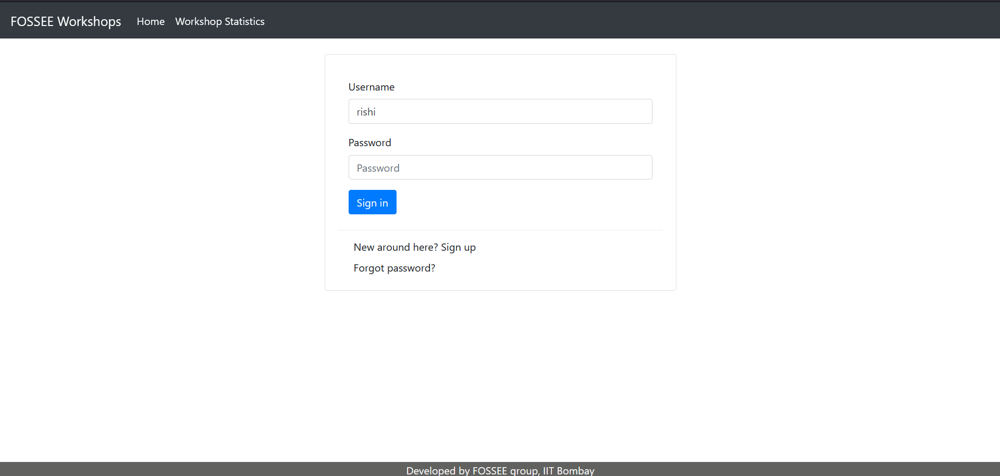
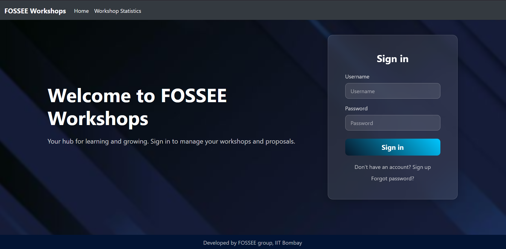

# **Workshop Booking**

> This website is for coordinators to book a workshop(s), they can book a workshop based on instructors posts or can propose a workshop date based on their convenience.

### Features
* Statistics
    1. Instructors Only
        * Monthly Workshop Count
        * Instructor/Coordinator Profile stats
        * Upcoming Workshops
        * View/Post comments on Coordinator's Profile
    2. Open to All
        * Workshops taken over Map of India
        * Pie chart based on Total Workshops taken to Type of Workshops.

* Workshop Related Features
    > Instructors can Accept, Reject or Delete workshops based on their preference, also they can postpone a workshop based on coordinators request.

# Guide to install and get this website running

### Follow below given Steps to get started
> __NOTE__: Use Python3 
1. Clone this repo.
    > git clone https://github.com/FOSSEE/workshop_booking.git

2. Create a virtual environment and install all the required packages from requirements.txt
    > pip install -r requirements.txt 

3. Make Migrations and Migrate
    > python manage.py makemigrations\
    > python manage.py migrate

4. Create Super User
    > python manage.py createsuperuser

5. Start Server
    > python manage.py runserver

6. Goto admin page and login using superuser credentials
    > localhost:8000/admin

7. Goto Groups and create one group called __instructor__ and give it all permissions.

8. By default when a user registers, he is assigned a coordinator position, using the admin panel set the required users profile position as instructor and add him/her in instructor group along with the required permissions.

9. Under *settings.py* file see to it that all required variables are set then you're good to go!

### Instructor specific steps

1. An instructor can create workshops as per his/her availibility in __Create Workshop__ tab.

2. Instructor can see monthly workshop count, upcoming workshop etc. in Statistics > Workshop Statistics

3. Instructors can view and post comments on coordinator's profile from Profile Statistics or Workshop Status page.

### Coordinator specific steps

1. A coordinator can sent workshop proposal based on his/her convenience under Workshops > Propose a Workshop option.

## Design Principles and Improvements

The improvements were guided by the **principles of simplicity and user-centricity**. My goal was to create a clean, intuitive interface that prioritizes user needs. This involved decluttering the layout, ensuring a logical flow, and using a consistent visual hierarchy to guide the user's eye. Key improvements included:
- **Consistent UI:** I used a unified color palette, typography, and spacing to create a cohesive and professional look.
- **Improved Navigation:** The navigation menu was simplified and made more prominent for easier access to all sections.
- **Enhanced Readability:** I chose a readable font and optimized line height and character spacing to improve the user experience.

---

### Before and After

To showcase the impact of these changes, here are screenshots of the previous and new designs.

**Before:**
(assets/O_LogoutPage.png)(assets/O_RegistrationPage.png)

**After:**
 (assets/M_logout.png) (assets/M_register.png)

---

## Ensuring Responsiveness

I ensured responsiveness using a **mobile-first approach**. I started by designing and developing for the smallest screens first, then progressively enhanced the layout for larger devices. I used **CSS Grid and Flexbox** extensively, which are modern layout modules perfect for creating flexible and fluid designs. The key steps were:
- **Viewport Meta Tag:** I included the `viewport` meta tag in the HTML to correctly scale the page on different devices.
- **Relative Units:** I used relative units like percentages (`%`) and `em` instead of fixed pixel values (`px`) for font sizes and widths.
- **Media Queries:** I used CSS media queries to apply specific styles for different screen sizes, adjusting layouts, font sizes, and image dimensions as needed. 

---

## Design vs. Performance Trade-offs

I made a few key trade-offs to balance design and performance.
- **Image Optimization:** Instead of using high-resolution, uncompressed images, I used **optimized images** in modern formats like WebP. This slightly reduced visual fidelity but drastically improved loading times.
- **Minimal Animations:** While complex animations can enhance the user experience, they can also impact performance. I chose to use only subtle, simple animations that provided a **functional purpose** (like a hover effect) rather than purely decorative ones.
- **Font Loading:** Instead of loading multiple custom fonts, I opted for a **single, highly-optimized font** to reduce HTTP requests and font file size, which can be a major performance bottleneck.

---

## The Most Challenging Part

The most challenging part of this task was **refactoring the existing codebase to accommodate the new design without introducing new bugs**. The original code had a lot of legacy CSS with inconsistent naming conventions and overlapping styles.

My approach was systematic:
1.  **Auditing the Code:** I first conducted a thorough audit to identify and document all the style conflicts and redundancies.
2.  **Creating a Style Guide:** I created a simple style guide with the new design's colors, fonts, and spacing rules. This served as a single source of truth.
3.  **Modular Refactoring:** I refactored the CSS module by module, component by component, replacing old styles with new ones based on the style guide. I used a consistent naming convention like **BEM (Block, Element, Modifier)** to ensure the new styles were predictable and maintainable.
4.  **Continuous Testing:** I performed continuous testing on various devices and browsers throughout the refactoring process to catch and fix bugs as they appeared, rather than at the very end.